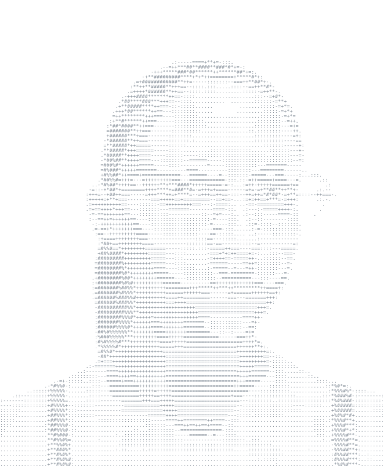

### Hi, I'm DEN 👋

> I studied economic informatics and now I am enriching my skills

I am into logistics, data entry, python, Linux and websites. Besides my faculty projects 
I do projects on these specific topics.

`python` `react` `node` `Linux` `HTML` `CSS`

---

### Projects

**[BACHELOR](https://github.com/dendenjamzz/MindMap.git)** · `Node.js, python, CSS, HTML`

Bachelor project

Its a brainstorming site where the user can input ideas and get a set of new ideas as a graph which looks like a constellation from the input words 
and also a set of different tools to use on those ideas like comparing the ideas or generating new ones until the graph looks fine. 
The user can style the graph and also see the meaning of each word and why are they connected and the graphs are organized by the date 
they were made to be able to keep track of them and to analyze them later.
The objective of this site is to give the user the ability to see their ideas expanded in a visual way and to use the tools provided on them in order
to achieve different outcomes like: only wanting to keep track of their ideas, comparing ideas based on different requirements or even to see how far the mind can go.
The project is using two servers which are: Node.js and Python. Node.js is for the authentication part and database connection and the python server is
used for the natural language processing algorithm which is using the Wordnet library and Wu palmer similarity score in order to make the new words 
and links between them. The frontend is blank only html and CSS.

**[FILES FOR MY WEBSITE](https://github.com/dendenjamzz/mywebsite.git)** · `HTML`

This is my own website which is a simple HTML page and it shows my interests, my GitHub, Pinterest and vinted accounts and also it has a form for anyone who wants to let a message.
The site will be connected to a neo city site soon which will have my python games or projects and also my pixel art.

[LINK FOR MY WEBSITE](https://dendenjamzz.github.io/mywebsite/)

For other projects check my repositories (they are faculty projects for now) · `C++, C#, C, Java, Python, PowerBi, UIPath, Linux, HTML, CSS, NOde.js`
---

[LinkedIn](https://www.linkedin.com/in/denisa-maria-pavel-01879926b/) · [email](paveldenisamaria14@gmail.com)
